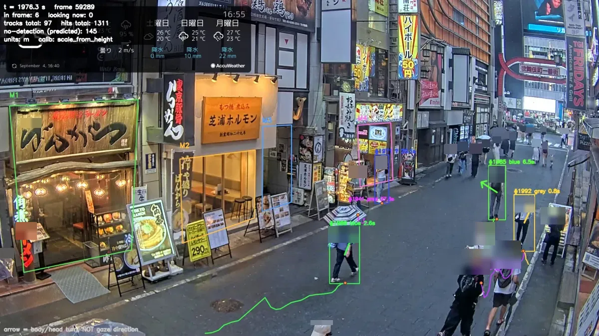
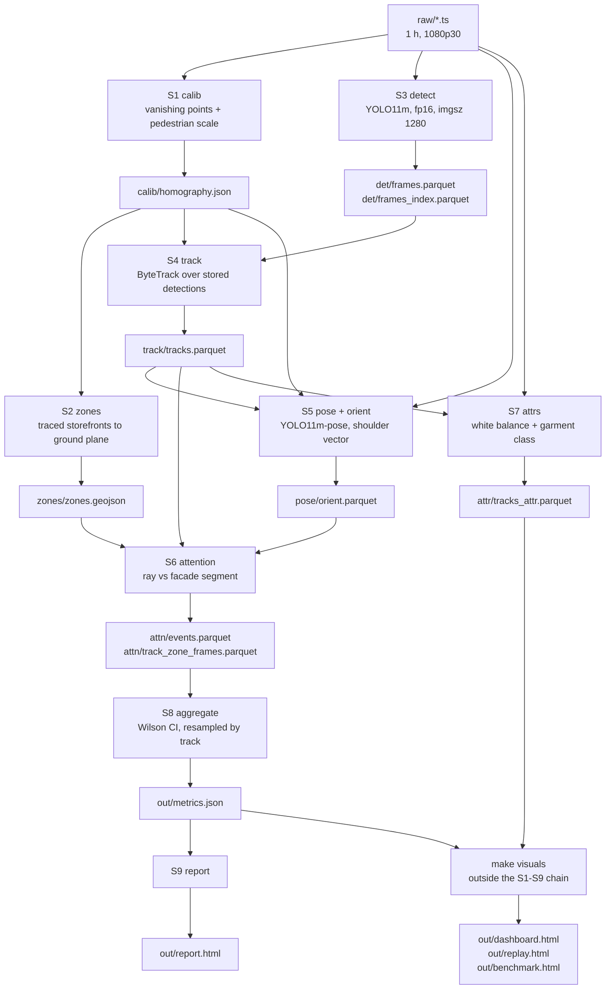
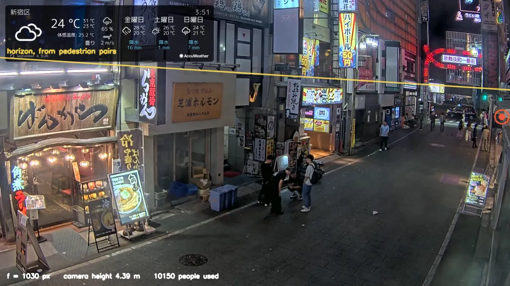
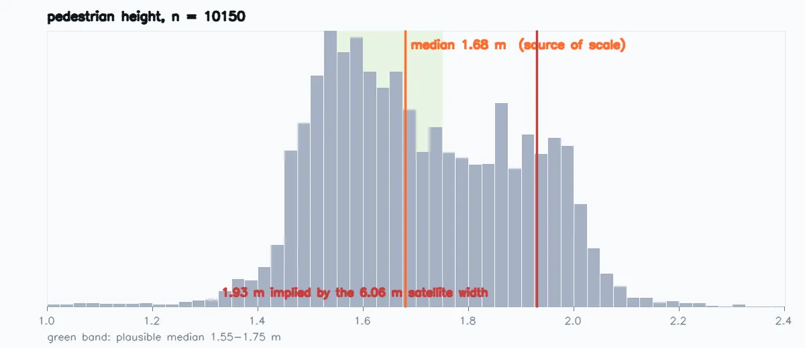
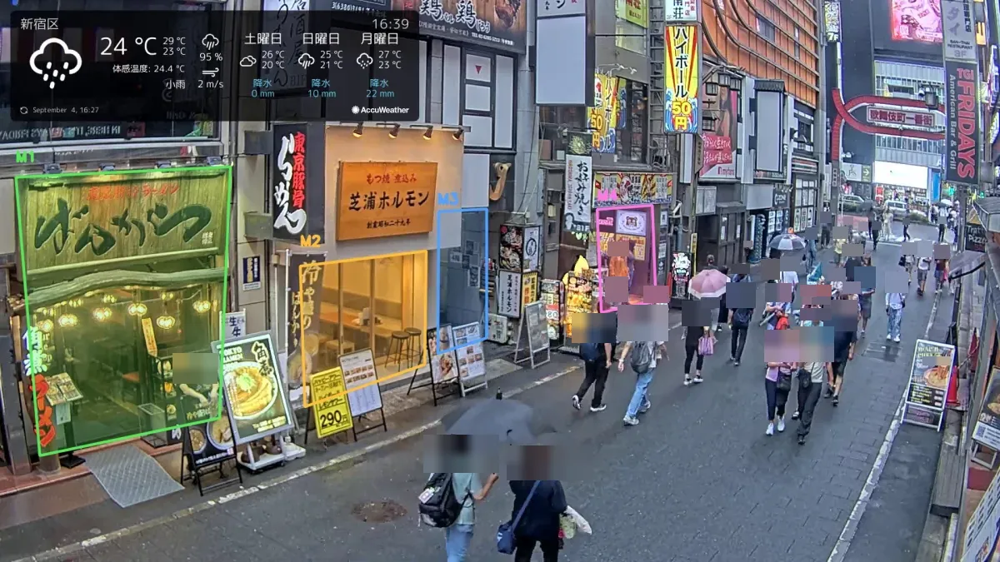
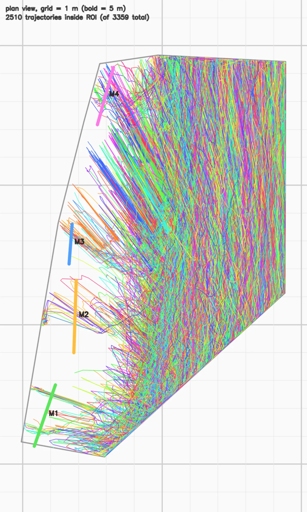
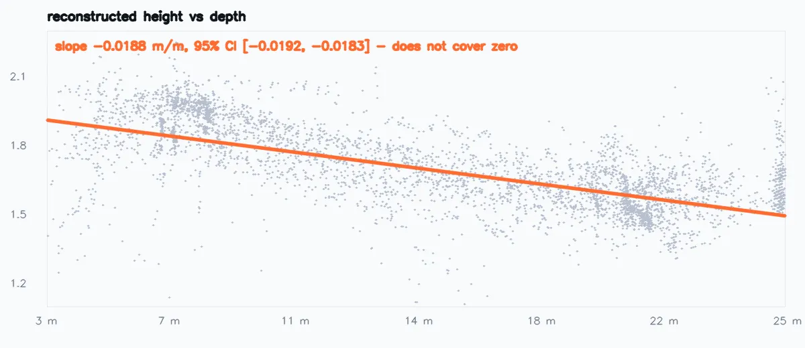

# CAM-01 Kabukicho

Street-level attention analytics from a single fixed camera.


[Live dashboard][pages] · [Overlay video](https://youtu.be/3ZXDQcmrOUI)

The published dashboard carries a reduced evidence set — twelve frames per storefront,
forty-eight in all, stratified by confidence exactly as the full build is. **The complete
archive of 394 crops is deliberately not published**: blurring a face does not make a crop
non-personal, and a public indexed URL is a different order of exposure from a local file.
The reasoning is in [`docs/DECISIONS.md`](docs/DECISIONS.md) §12. The full archive, the
replay page and the overlay video are all available from a local run.

<!-- The published dashboard address lives in exactly one place: the [pages]
     definition at the bottom of this file. Change it there and every link
     in the README follows. -->

An offline pipeline that turns one **already recorded** hour of a public street
camera into
per-storefront attention metrics, with a confidence interval on every rate and,
for every claim that carries frames, a grid of the actual anonymised frames behind it.

---

## The numbers

Final run, `raw/peak_hour.ts`, 2026-09-04.

| | |
|---|---|
| Window | 16:25–17:25 JST, 60 min, 36 000 of 108 000 frames processed |
| Tracks | 3 359 |
| Turned toward a storefront | 514 (15.3 % of tracks) |
| Best storefront | M3, 13.3 % turned, 95 % CI [12.1, 14.7], median attention 1.4 s |
| Orientation MAE | 21.2°, 95 % CI [15.5, 28.8], n = 50 hand-labelled on this hour |

Every metric in `out/metrics.json` carries its source stage, its source artifact and a
`compute_ref` — the file, function and line that computed it. `out/report.html` renders
that reference for 6 of the 22; it is built by every run and is not published, for the
reason given under [Provenance](#provenance).

---

## What it measures

- **Presence.** Unique tracks, and mean simultaneous detections per 10-second bin.
- **Storefront proximity.** Tracks whose ground position comes within 8 m of a
  facade segment. Apron-polygon entry is recorded per frame but never aggregated into
  a metric: it feeds the stop test only. `visitors_*` therefore counts approach, not
  entry.
- **Attention.** Tracks whose orientation sector geometrically crosses the facade
  segment, grazing angles excluded.
- **Stops.** Speed below a relative threshold inside an apron polygon.
- **Upper-garment colour class** (10 classes, the largest being blue, grey and
  black), after white-balance compensation, on 48 % of tracks. Coverage only —
  the accuracy of this classifier was never validated against labels.

## What it does not measure

- **Not gaze.** Orientation is a turn of the body or head. The system has no eye
  tracking and makes no claim about where a person is looking.
- **Not interest.** A geometric ray crossing a segment is not a mental state.
- **No demographics.** Gender, age and ethnicity are not estimated and will not be:
  privacy, and no ground truth to gate them against.
- **No face recognition, no re-identification across cameras.** Face regions in every
  published crop are pixelated and blurred before anything reaches disk. The setting on
  disk is mixed: 173 of 257 crops were written at a blur fraction of 0.22, which the
  owner later raised to 0.30 because at distance the head sits higher in the crop.
  Regenerating them needs a re-run of S3, S5 and S7 that has not been done.
- **No shop entries.** There is no metric for "walked through the door"; the funnel
  ends at "stopped".

---

## The overlay

[](https://youtu.be/3ZXDQcmrOUI)

Three minutes of the processed hour, rendered from the stored artifacts rather than
from a second inference pass: [youtu.be/3ZXDQcmrOUI](https://youtu.be/3ZXDQcmrOUI).

Storefront zones are drawn as polygons; a zone label gains `<- #id` in the frame
where that track's ray is counted against it. Each box carries the track id, the
upper-garment colour and the dwell time; a box marked `pred` is a tracker prediction
for a frame with no detection. The arrow is the turn of the body or head, and the
frame says so in as many words rather than leaving it to be assumed. The HUD counts
people in frame, how many are counted as turned toward a storefront at that instant,
cumulative tracks and ray hits, and the source of the metric scale.

The ground-plane panel is a **separate** render, `make overlay-plan`, not this video.

**This video is not anonymised.** The pixelation and blur described above apply to the
evidence crops the pipeline writes to disk, not to a re-render of a stream that YouTube
already publishes publicly. Nothing in `scripts/render_overlay.py` touches faces.

---

## Architecture



Four rules shape the whole thing:

**Stages are isolated and talk only through files.** No stage calls another. Each reads
the previous stage's artifact and writes its own. The schemas in
[`docs/CONTRACTS.md`](docs/CONTRACTS.md) are the API; a column with spatial meaning and
no `_px` / `_m` suffix is a review error.

**Every stage has a gate script; two of them compute their gate metric.**
`verify/verify_s1.py` and `verify/verify_s5.py` measure and print theirs. Three more —
S4, S6 and S7 — compute no gate metric but do run one real check, comparing the sha256
of every recorded input against the file on disk, and that check decides their exit code
under `--allow-unmeasured`. The remaining five name the metric they cannot compute,
return 1 and say so. All ten currently fail. `verify/verify_s<N>.py` returns 0 or 1 and prints its
metrics. "I checked it visually" is not a gate. A threshold is never nudged to make a
gate pass — the reason for the failure goes in
[`docs/DECISIONS.md`](docs/DECISIONS.md) first.

**No number is obtained by eye.** Everything in the report is computed by code from an
artifact on disk, and the line that computes it can be pointed at.

**Anything unmeasured is labelled unmeasured** — with one gap: the ROI boundary is
not among the numbers printed into `out/metrics.json`, only attribute coverage and the
share of
indirect foot points, the ROI boundary — all printed explicitly. 40 % coverage with an
honest figure beats 100 % with rubbish.

---

## Calibration

This is the part worth reading. The camera is a public live stream: no intrinsics, no
survey, no reference object in frame.

### Geometry from vanishing points



The horizon is recovered from pairs of pedestrians — under an equal-height assumption
the foot line and the head line of any two people intersect on the horizon. 16 810
pairs, 38.7 % inliers, residual 12.2 px. The focal length then follows from the
pole-polar relation between the horizon and the vertical vanishing point:
**f = 1030 px** (0.47 of the frame diagonal), **camera height 4.39 m**.

### Four generations of calibration, three of them rejected

| Generation | Outcome |
|---|---|
| Vanishing points from manual clicks | **Rejected.** Focal 541 px, camera height 2.13 m, height IQR 5.39 m, median speed 113 m/s. Five independent quantities disagreed at once. |
| Affine stub | Used only to keep the pipeline running end to end. Every number it produced was discarded. |
| Manual ground plane | Superseded. |
| **Self-calibration from pedestrians** | Accepted for geometry: horizon, focal length and camera height from 10 150 accepted detection boxes, focal 1030 px. The street direction is still a one-time hand seed — clicked lines in `configs/calib_hints.yaml`, which ship with the repository. |

The failure of generation 1 was not subtle: a reconstructed height spreading over 21
metres and a median walking speed of 113 m/s both point at a wrong vertical vanishing
point, and with it a wrong focal length.

### Scale comes from height, and the satellite reference was rejected



Scale — how long a metre is — rests on exactly one assumption: the sampled median
pedestrian height is 1.68 m.

A satellite measurement of the street width (6.06 m ± 0.4, building to building) was
tried as the scale source and **rejected**: it implies a median pedestrian height of
**1.93 m**, outside the plausible 1.55–1.75 m band. The threshold was not widened to
accommodate it. Instead the inverse problem was solved — 6.06 × 1.68 / 1.93 =
**5.28 m** — which is consistent with the clicked points being a **kerb rather than the
opposite building wall**, a 0.78 m setback.

The cost is stated plainly on the dashboard: **height is no longer an independent
check, because it now defines the scale.** One independent check remains, and it is a
plausibility argument, not a measurement.

### The plan view is the calibration check you can make with your own eyes



Facades and aprons are drawn once in pixels on this frame and projected to plane
metres; every later stage reasons in metres.



The street is straight. If the homography is right, trajectories projected onto the
ground plane must run straight and parallel along it. They do. Grid squares are 1 m.

### Height drifts with depth, and that is not called a street gradient



Reconstructed height falls systematically with distance: **−0.0188 m per metre**, 95 %
CI [−0.0192, −0.0183], which does not cover zero. A 4.9 % ground slope would explain
it exactly.

**That number was wrong until this was written, and the gate did not catch it.**
`calib/homography.json` stores `height_depth_slope` as −0.0163, which is the true value
multiplied by `scale_rescale_factor` = 0.8714 — but a slope in m/m is invariant when
heights and depths are rescaled by the same factor, so the multiplication at
`looq/stages/s1_calib.py:208` was simply wrong. The tell was internal: the stored grade
of 4.9 % follows from −0.0188 and not from −0.0163. The gate recomputed the slope from
the artifact's own arrays and then silently preferred its own answer instead of
comparing the two; `verify/verify_s1.py` now compares them and fails on a mismatch. The
stored field stays stale until S1 is re-run, and the figure above is plotted from the
arrays rather than from the field.

**It is still not called a street gradient**, and this matters. A hand analysis recorded
in [`docs/DECISIONS.md`](docs/DECISIONS.md) — shifting the vertical vanishing point by
±10 % changes the drift by only 8 % and never brings it to zero — points at the scene
rather than the calibration. The same holds for the depth split of the orientation
error quoted further down — 25.4 deg against 17.3 and the -0.27 correlation were derived
by hand from `labels/s5_orient_50.jsonl`, and no stage recomputes them.
**No code in this repository computes that sweep either**, so
unlike every other number here it cannot be pointed at a line; treat it as an argument,
not a measurement. But "the scene" could be a slope, a systematic bias in the
foot point at distance, or a selection effect in who gets detected far away. We
measured a drift. We did not measure a gradient. The report says drift.

---

## Measured accuracy

Orientation is the only model output with hand-labelled ground truth.

| | |
|---|---|
| MAE | **21.2°** |
| 95 % CI (bootstrap) | [15.5, 28.8] |
| Median error | 15.6° |
| p90 error | 36.2° |
| n | 50 tracks, one crop each, labelled by hand |
| Labelled on | `raw/peak_hour.ts` — the same hour the metrics describe |
| Errors > 90° | **2 %** (1 of 50, off by 172°) |

The labelling protocol avoids eyeballing angles: the labeller clicks the point on the
ground the person is facing, and the angle is computed by the same homography that the
pipeline uses. Prediction is hidden during labelling so it cannot anchor the answer.

**One gross error, and it is the informative kind.** A single track of the 50 is off by
172° — very nearly a half-turn. That is not a sign-convention error: a wrong sign or a
mirrored plane would flip all fifty, not one. It is the front/back ambiguity of an
estimate built on the shoulder line, which is symmetric, so an unlucky pose reverses it.
The systematic failure mode that would corrupt every attention number silently is
therefore still ruled out; a 2 % per-sample reversal rate is not.

**Accuracy depends on depth, and one number hides it.** On boxes shorter than the median
243 px the MAE is **25.4°**; on taller ones **17.3°**, with the error correlating with
box height at −0.27. Distant pedestrians are estimated worse, and since the far
storefronts are the distant ones, a single scene-wide MAE flatters them.

**The gate does not confirm.** The point estimate 21.2 is under the 25.0 threshold, but
the confidence interval [15.5, 28.8] covers it, so the gate reports the number as not
confirmed rather than as a pass. Fifty labels is a quarter of the 200 the rule asks for,
and that is exactly what the interval width is saying.

**The measurement changes the geometry, twice over.** `yaw_uncertainty_deg` — the
half-width of the orientation sector — began as a placeholder at 15.0 marked NOT
CALIBRATED, which made the sector far narrower than justified and undercounted facade
hits. Project rules require it to equal the measured MAE, so it became 25.5 from the
first labelling round and **21.2** from this one.

That is not a cosmetic edit: it decides who counts as turned toward a storefront.
Re-labelling on the correct hour narrowed the sector by 4.3°, which alone took the
headline from 396 turned tracks to 284. Two defects found in review then moved it the
other way, to **514** — see below.

---

## How errors were found

Nine defects in the code, caught by measurement rather than by looking: four from
building the pipeline, three from a review that read every claim back against the
artifacts, one from a dry run that re-computed a stage into a scratch file and diffed it
against the artifact in use, one from synthetic data with known ground truth.

Then twenty more in the prose — the commit messages and this file — found the same way,
by re-reading them against the code. Those are described at the end of this section,
because they were the most numerous and the least expected.

**Units in the zone projection** (guards: `looq/stages/s6_attn.py:91,168`). `calib/homography.json` holds two matrices:
`H` in metres and `H_px_to_unit` in camera-height units. S2 projected zones with the
second while S4 projected tracks with the first, so zones came out **4.4× too small** —
facades of 0.5 m instead of 2.3 m. A half-metre facade is crossed by almost any ray, so
all four storefronts reported **exactly 47 visitors**. Four identical counts is the tell.
Two guards now exist: S6 refuses to run if the geojson's homography sha does not match,
and — because one file holds two matrices and a sha match is not enough — it also
compares the spatial span of zones against the span of tracks and fails if the ratio
leaves [0.05, 20].

**The mirrored plan** (`scripts/render_overlay.py:122`). `PlanView._swap` returned `p[:, ::-1]`. Swapping two
columns is a transposition — a reflection with determinant −1 — not the intended 90°
rotation. Storefronts were drawn to the right of the road; in the camera they are on the
left. The homography was exonerated numerically before the drawing code was touched: the
Jacobian of the stored `H` is −1, matching `CANONICAL_PLANE_SIGN`, and a +y step in
metres moves **95.6 px to the left** in the image. This one nearly hid: a global
reflection leaves every intersection predicate invariant, and the only thing that breaks
is `facing = [-v[1], v[0]]` in `looq/calib.py`, because a +90° rotation does not commute
with a reflection — **every orientation would have flipped 180° and no gate would have
noticed**. Four regression tests now pin the plan's layout, one of them asserting the sign of the
signed area directly.

**A comment that promised what the code never did.** `SKIP_OUT_OF_WINDOW` is defined in
`looq/stages/s3_detect.py` and documented as a legal `skip_reason`, and a comment claimed
truncated frames land in `frames_index` under it. They never did: truncation happens
before the loop, so those frames are simply never reached, and the column holds zero such
rows. The comment now states the truth. The same commit raised `max_frames` from 5400 to
108 000 — at 5400, S3 would have silently processed three minutes of a one-hour recording.

**Two counters contradicting each other in one report** (`scripts/make_replay.py:549`). The replay printed
**279 ray hits** while the dashboard, from the same artifacts, reported **3 turned
tracks**. The replay was reading raw `gaze_hit` with no filtering. The chain was measured
and published; on the final hour it runs **35 114 raw → 31 756 after dropping grazing
angles → 13 097 frames across 514 tracks** once restricted to the events S6 actually
counted, and the replay page prints its own version of that chain on every build. Counter labels were renamed
so that instantaneous and cumulative quantities stop reading as the same thing.

**A formula that had quietly stopped matching its own definition**
(`looq/stages/s6_attn.py:290`). `gaze_score` is defined in CLAUDE.md and in
`docs/CONTRACTS.md` as the share of the frames a track spends **inside the 8 m window**
during which the orientation sector crosses the facade. The code divided by every frame
of the track that had a measured angle, including frames where the person was far away
and could not have hit the facade at all. Numerator and denominator lived on different
sets, so the score was diluted by how long a track existed rather than by where it
looked: the median denominator was 64 frames against 31 inside the window. Restoring the
contract took the headline from 284 turned tracks to 670.

**Restoring it exposed a second problem the dilution had been hiding.** With the correct
denominator, **39 %** of counted events rested on fewer than 10 in-window frames and
**27 %** on fewer than five; storefront M4 had a median denominator of **three frames**,
so its 9.5 % was a one-in-three ratio. A share threshold stops meaning anything once the
denominator drops below `1 / threshold`, because a single frame already clears it — which
is exactly what the threshold exists to prevent. Events below that bound are now marked
`low_confidence`: kept in the data, out of the aggregate. 313 events, and the headline
settles at **514**.

**Every speed in the pipeline was three times too low** (`looq/stages/s4_track.py:164`).
The sliding least-squares fit took frame indices and divided them by the rate of
*processed* frames. With `frame_stride: 3` consecutive processed frames are 3 apart in
index but 0.1 s apart in time, so the fit used dt = 0.3 s where the truth was 0.1 s. The
median pedestrian speed read 0.30 m/s instead of **0.89 m/s**, and the
`max_plausible_mps: 4.0` guard — whose entire job is to null out bad ground-plane
projections — had never once fired, because nothing could reach 4 m/s when everything was
divided by three. It now nulls 5.8 % of rows. A regression test pins the invariant:
the same motion sampled densely and every third frame must give the same speed.

**The calibration could not be reproduced, and nothing said so**
(`looq/stages/s1_calib.py:308`). S1 takes its reference frame and its pose
keypoints from the clip named in its config, but its pedestrian sample from
whatever `det/frames.parquet` currently holds — and S3 overwrites that file on
every run. The calibration in use was computed when it held the three-minute
debug clip; it now holds the peak hour. **The homography every metre in this
project rests on was computed from a detections file that no longer exists**,
and the artifact gave no way to notice: it records the debug clip by name and
10 150 boxes, with nothing tying those boxes to that clip.

Re-running S1 today returns focal **947 px against 1030** and camera height
**4.26 m against 4.39** — a different geometry for every measurement in the
project, arrived at silently, because the stage would mix one recording's
frames with another recording's detections.

This was caught by running S1 into a scratch file and diffing the result
against the artifact, not by reading the code and not by looking at anything.
The homography now carries the sha256 of both its inputs and the S1 gate
compares them against disk; on the published artifact that check fails,
correctly, because it predates the field. The published geometry is
deliberately left as it is — see Limitations.

**Two audits after the code was finished, because the code was not the only thing
that could be wrong.**

The first read the twelve commit messages back against the repository they describe.
Five claims did not hold: the ingest commit described recording and gap checking that
`looq/stages/s0_ingest.py` does not implement (28 lines, status `not_implemented`); the
scaffold commit stated face anonymisation as an accomplished fact while 173 of 257 crops
carried a blur fraction the owner had rejected; the calibration commit claimed two
independent cross-checks where the artifact records one and says so itself; the zones
commit claimed the ROI drops tracks upstream, which no stage does; and the scaffold
commit claimed every artifact has a schema in `docs/CONTRACTS.md` while
`attn/track_zone_frames.parquet`, read by four consumers, had none. Four messages were
rewritten and the missing contract was written.

The second read every capability sentence in this README against the code that must
implement it. **Fifteen** did not hold. Two are worth naming. "Every stage has a gate"
was false: **two of the ten gates compute a metric**, the other eight name the metric
they cannot compute and return 1 — honest in the terminal, not honest here. And "zone
entry: tracks whose ground position enters a storefront's apron polygon" described a
metric that does not exist: `visitors_*` counts tracks that came within 8 m of the
facade, and the two quantities **differ by a factor of thirty**. The rest were of the
same kind — a manual step described as automatic, a stale test count, a claim of no face
imagery while three street frames sat unblurred in `docs/img`.

Every one of the twenty was fixed before publication. The finding rate says something
uncomfortable and worth saying plainly: prose about a system drifts from the system
faster than the system drifts from itself, and nothing but a mechanical re-read catches
it.

A fifth defect, found on synthetic data with known ground truth: **speed from neighbouring
frames was biased 5× high.** At 30 fps a pedestrian moves ~4 cm per frame while the
projected jitter of the foot point is 10–20 cm; because speed is a magnitude, the noise
does not cancel under averaging — it pushes the median up. On synthetic tracks with a
true speed of 1.30 m/s, neighbour differencing returned **6.5 m/s**. Replaced by an OLS
slope over the whole burst.

---

## Provenance

Two files that no stage can regenerate ship with the repository, because without
them nothing on the dashboard can be traced back to anything:

- [`zones/zones.json`](zones/zones.json) — the four storefronts and the ROI, traced by
  hand once on the reference frame. Twenty clicks; no code produces it.
- [`calib/homography.json`](calib/homography.json) — the geometry every metre rests on.
  S1 writes it, but re-running S1 today yields a different one, so this file is the only
  record of the geometry the published numbers were computed with.

**Every artifact carries the sha256 of its inputs.** `write_parquet` stores
`{path: sha256}` of the stage's declared inputs in the parquet file metadata, and
`check_inputs_sha` compares what an artifact remembers against what is on disk now. The
S1, S4, S5, S6 and S7 gates fail on a mismatch, and an artifact that recorded nothing
fails too — silence is not a pass. `tests/test_inputs_sha.py` pins the case the
mechanism exists for: write an artifact, change the input, the check must fail.

This is not decoration. It caught the worst defect in the project: S1 draws its
pedestrian sample from `det/frames.parquet`, which S3 overwrites, so the published
calibration was computed from a detections file that no longer exists — see
[How errors were found](#how-errors-were-found). The S1 gate now fails that check on
purpose, and the failure is left standing.

Each metric in `out/metrics.json` also carries its source stage, that stage's quality
metric and a `compute_ref` — file, function and line. `out/report.html` renders those
for six of the twenty-two. That page is built by every run but is **not published**: it
is the internal engineering report, and a reader who came for the result should not have
to walk through which function computed which number to reach it.

---

## Quickstart

```bash
pip install torch==2.11.0 torchvision==0.26.0 --index-url https://download.pytorch.org/whl/cu128   # not in requirements.txt
pip install -r requirements.txt
python -m pytest tests/ -o addopts="" -q     # 101 passed, 2 skipped on a fresh clone
make serve                                    # http://localhost:8080, serves out/
```

The two skipped tests check that every row of the evidence index points at a file that
exists and is the anonymised one; they need a completed run and skip on a fresh clone.

`out/` is empty on a fresh clone: the pages exist only after a run.

`make serve` starts nginx in Docker over `out/`. Without Docker: `make serve-nodocker`
runs a small server that implements HTTP Range, which the replay needs to seek the video.

To reproduce a run you need the recordings, the model weights and a GPU. Two inputs no
stage can regenerate ship with the repository, because the published numbers cannot be
checked without them:

- [`zones/zones.json`](zones/zones.json) — the four storefronts and the ROI, traced by
  hand once on the reference frame. Twenty clicks in an OpenCV window
  (`make zones` → `scripts/pick_zones.py`). For a different camera you trace your own;
  S2 refuses to run without the file.
- [`calib/homography.json`](calib/homography.json) — the geometry every metre rests on.
  S1 writes it, but re-running S1 today produces a different one, so this file is the
  only record of the geometry the published numbers were computed with. See the
  reproducibility row in Limitations.

S1's clicked seeds ship too, in [`configs/calib_hints.yaml`](configs/calib_hints.yaml).
Everything else under `calib/`, `zones/`, `det/`, `track/`, `pose/`, `attn/`, `attr/`
and `out/` is stage output and is regenerated by a run.

Full command sequence in the [`Makefile`](Makefile). `make run-all` covers S1-S6 and
S8-S9: S0 is not implemented and S7 (garment colour) runs separately as `make attrs`.
Every run
writes `run_manifest.json` with the weights sha256, imgsz, device, precision and library
versions, because pinned requirements are only half of reproducibility. One gap: S1 runs
YOLO11m-pose through its own config key rather than the shared one, so its manifest entry
records the model fields as null even though the calibration depends on that inference.

---

## Limitations

| Item | What is going on | Consequence |
|---|---|---|
| Source of scale | Scale comes from the median pedestrian height. Street width was rejected as the source: the 6.06 m satellite reference implies a 1.93 m median height. | Height is not an independent check — it defines the scale. One independent check remains: the implied L1–L3 distance of 5.28 m falls inside the plausible 4.6–5.6 m. |
| Street grade | The ground is modelled as flat, yet reconstructed height drifts with depth. A 4.9 % grade would explain it. | Lengths and speeds are distorted more far from the camera than near it. Sensitivity analysis excludes the calibration as the cause; the scene is not identified. |
| Vanishing point vs horizon | The two estimates disagree by 104 px against an 87 px tolerance. | Two independent estimates of one quantity did not converge; focal length, and with it scale, are less well determined than we would like. |
| Reproducibility of the calibration | The published geometry is reproducible only from an archived input. Its sha256 is now recorded in `calib/homography.json`, but the detections file it was computed from has been overwritten by a later S3 run. | The S1 gate fails 7 of its 9 checks and every failure is left standing rather than hidden: this provenance check (deliberate), the held-out reprojection error that the self-calibration path never implemented, the height spread, the pedestrian speed and the facade baselines the gate asks for and the artifact does not carry, and the vanishing-point holdout residual. On the next full run the calibration is measured afresh and every metre in the report is recomputed with it. |

## Not measured

| Quantity | Why it has no number |
|---|---|
| Detection AP@0.5 | no ground truth for 300 frames |
| Tracking IDF1 / ID switches | no ground truth — **tracks are not people**; the tracker both splits and merges |
| Orientation MAE at full sample | measured on 50 people, not the 200 the gate asks for; the interval still covers the threshold |
| Orientation MAE by depth | 25.4° on far boxes against 17.3° on near ones is a two-bin split, not a calibrated curve |
| Vanishing-point sensitivity | the ±10 % sweep is a hand analysis in `docs/DECISIONS.md`; no code computes it |
| Attention-event precision | no ground truth for 100 events |
| Clothing colour accuracy | no labelled crops; white balance applied but not validated |
| Recall by depth | the 70 px box-height cutoff is a proxy, not recall |

Coverage figures that bound everything above: a body orientation exists for **45.6 %** of
track-frames and for **70.7 %** of tracks, the upper-garment class for **48 %** of
tracks, and **100 %** of foot points are indirect
(taken from the bottom of the detection box rather than from ankles; S5 refines 37.6 %
of rows where the pose is confident).

---

## License

Licensed under the **GNU Affero General Public License v3.0** — see [LICENSE](LICENSE).

The AGPL is inherited from [Ultralytics](https://github.com/ultralytics/ultralytics),
which provides the detector and the pose model. **For commercial use the detector must be
replaced** with a permissively licensed model such as RT-DETR or YOLOX. The interface is
partly abstracted: the two inference stages `looq/stages/s3_detect.py` and
`looq/stages/s5_orient.py` write `det/frames.parquet` and `pose/orient.parquet`, and
everything downstream reads those artifacts without knowing what produced them. Swapping
the model is nevertheless not a one-file change — Ultralytics is also constructed in
`looq/pilot.py` (the detector behind S1's pedestrian sample) and in
`looq/stages/s1_calib.py` (the pose model that fixes the metric scale) and imported in
`looq/stages/s4_track.py` (`BYTETracker`), plus two helper scripts.

Source footage is a third-party public live stream. Three frames of it are committed as
figures in `docs/img/` — the overlay still, the zone reference and the vanishing-point
frame — and all three **are** anonymised: `scripts/anonymise_figures.py` runs the
detector over each and applies the same `looq/evidence.py::blur_face_region` used on the
evidence crops, at a deliberately low detector threshold because a blurred lamppost
costs nothing and a missed face costs everything. `docs/img/dashboard.webp` embeds 48
evidence crops of real people, blurred by the same function.

One honest limit on that: the blur covers the top 30 % of a person's box, so a head
sitting lower in the frame than the box implies is not structurally guaranteed to be
covered. Measured on the committed figures, no confident facial keypoint survives in a
sharp region — but the mechanism is a band, not a face detector, and "no face imagery"
rests on that measurement rather than on the design.

Beyond those, this repository contains no raw
video, no unblurred crops and no face imagery: `raw/`, `*.ts`, `*.mp4` and `*.pt` are
excluded by `.gitignore`, and every published crop passes through
`looq/evidence.py::blur_face_region` — pixelation followed by a Gaussian — before it
reaches disk, enforced by a single write path and a test that asserts it.

<!-- ONE place to set the published dashboard address. When GitHub Pages
     exists, put the URL here and restore the link on line 12 to
     [Live dashboard][pages] — those are the only two edits needed. The link
     is currently absent rather than pointing at nothing, because a dead
     anchor in the first screenful is worse than no anchor. -->
[pages]: # "GitHub Pages address not set yet"
