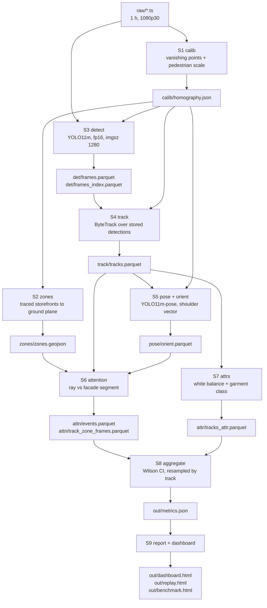

# CAM-01 Kabukicho

Street-level attention analytics from a single fixed camera.


<!-- Fill in after publishing: one line, two addresses. -->
[Live dashboard](#) · [Overlay video](#)

An offline pipeline that turns one hour of a public street camera into
per-storefront attention metrics, with a confidence interval on every rate and a
grid of the actual anonymised frames behind each number.

---

## The numbers

Final run, `raw/peak_hour.ts`, 2026-09-04.

| | |
|---|---|
| Window | 16:25–17:25 JST, 60 min, 36 000 of 108 000 frames processed |
| Tracks | 3 359 |
| Turned toward a storefront | 396 (11.8 % of tracks) |
| Best storefront | M2, 12.7 % turned, 95 % CI [11.4, 14.0], median attention 2.3 s |
| Orientation MAE | 25.5°, 95 % CI [18.7, 32.7], n = 24 hand-labelled, 0 % of errors > 90° |

Every number on the dashboard carries its source stage, its source artifact and a
`compute_ref` — the file, function and line that computed it.

---

## What it measures

- **Presence.** Unique tracks, and mean simultaneous detections per 10-second bin.
- **Zone entry.** Tracks whose ground position enters a storefront's apron polygon.
- **Attention.** Tracks whose orientation sector geometrically crosses the facade
  segment, grazing angles excluded.
- **Stops.** Speed below a relative threshold inside an apron polygon.
- **Upper-garment lightness**, after white-balance compensation, on 48 % of tracks.

## What it does not measure

- **Not gaze.** Orientation is a turn of the body or head. The system has no eye
  tracking and makes no claim about where a person is looking.
- **Not interest.** A geometric ray crossing a segment is not a mental state.
- **No demographics.** Gender, age and ethnicity are not estimated and will not be:
  privacy, and no ground truth to gate them against.
- **No face recognition, no re-identification across cameras.** Face regions in every
  published crop are pixelated and blurred before anything reaches disk.
- **No shop entries.** There is no metric for "walked through the door"; the funnel
  ends at "stopped".

---

## Architecture



Four rules shape the whole thing:

**Stages are isolated and talk only through files.** No stage calls another. Each reads
the previous stage's artifact and writes its own. The schemas in
[`docs/CONTRACTS.md`](docs/CONTRACTS.md) are the API; a column with spatial meaning and
no `_px` / `_m` suffix is a review error.

**Every stage has a gate.** `verify/verify_s<N>.py` returns 0 or 1 and prints its
metrics. "I checked it visually" is not a gate. A threshold is never nudged to make a
gate pass — the reason for the failure goes in
[`docs/DECISIONS.md`](docs/DECISIONS.md) first.

**No number is obtained by eye.** Everything in the report is computed by code from an
artifact on disk, and the line that computes it can be pointed at.

**Anything unmeasured is labelled unmeasured.** Attribute coverage, the share of
indirect foot points, the ROI boundary — all printed explicitly. 40 % coverage with an
honest figure beats 100 % with rubbish.

---

## Calibration

This is the part worth reading. The camera is a public live stream: no intrinsics, no
survey, no reference object in frame.

### Geometry from vanishing points


The horizon is recovered from pairs of pedestrians — under an equal-height assumption
the foot line and the head line of any two people intersect on the horizon. 16 810
pairs, 38.7 % inliers, residual 12.2 px. The focal length then follows from the
pole-polar relation between the horizon and the vertical vanishing point:
**f = 1030 px** (0.47 of the frame diagonal), **camera height 4.39 m**.

### Four generations of calibration, three of them rejected

| Generation | Outcome |
|---|---|
| Vanishing points from manual clicks | **Rejected.** Focal 541 px, camera height 2.13 m, height IQR 5.39 m, median speed 113 m/s. Five independent quantities disagreed at once. |
| Affine stub | Used only to keep the pipeline running end to end. Every number it produced was discarded. |
| Manual ground plane | Superseded. |
| **Self-calibration from pedestrians** | Accepted for geometry. 10 150 people, focal 1030 px. |

The failure of generation 1 was not subtle: a reconstructed height spreading over 21
metres and a median walking speed of 113 m/s both point at a wrong vertical vanishing
point, and with it a wrong focal length.

### Scale comes from height, and the satellite reference was rejected


Scale — how long a metre is — rests on exactly one assumption: the sampled median
pedestrian height is 1.68 m.

A satellite measurement of the street width (6.06 m ± 0.4, building to building) was
tried as the scale source and **rejected**: it implies a median pedestrian height of
**1.93 m**, outside the plausible 1.55–1.75 m band. The threshold was not widened to
accommodate it. Instead the inverse problem was solved — 6.06 × 1.68 / 1.93 =
**5.28 m** — which is consistent with the clicked points being a **kerb rather than the
opposite building wall**, a 0.78 m setback.

The cost is stated plainly on the dashboard: **height is no longer an independent
check, because it now defines the scale.** One independent check remains, and it is a
plausibility argument, not a measurement.

### The plan view is the calibration check you can make with your own eyes


The street is straight. If the homography is right, trajectories projected onto the
ground plane must run straight and parallel along it. They do. Grid squares are 1 m.

### Height drifts with depth, and that is not called a street gradient


Reconstructed height falls systematically with distance: **−0.0163 m per metre**, 95 %
CI [−0.0167, −0.0160], which does not cover zero. A 4.9 % ground slope would explain
it exactly.

**It is still not called a street gradient**, and this matters. A sensitivity analysis
ruled out the obvious alternative — shifting the vertical vanishing point by ±10 %
changes the drift by only 8 % and never brings it to zero, so the cause is the scene
rather than the calibration. But "the scene" could be a slope, a systematic bias in the
foot point at distance, or a selection effect in who gets detected far away. We
measured a drift. We did not measure a gradient. The report says drift.

---

## Measured accuracy

Orientation is the only model output with hand-labelled ground truth.

| | |
|---|---|
| MAE | **25.5°** |
| 95 % CI (bootstrap) | [18.7, 32.7] |
| Median error | 24.5° |
| n | 24 tracks, one crop each, labelled by hand |
| Errors > 90° | **0 %** |

The labelling protocol avoids eyeballing angles: the labeller clicks the point on the
ground the person is facing, and the angle is computed by the same homography that the
pipeline uses. Prediction is hidden during labelling so it cannot anchor the answer.

**Zero gross errors matters more than the MAE itself.** Not one track was turned by more
than 90°, so the sign convention and the plane handedness are right. That is the failure
mode which would corrupt every attention number silently.

**The gate fails, honestly.** 25.5 > the 25.0 threshold, by half a degree. The threshold
was not moved.

**The measurement changed the geometry.** `yaw_uncertainty_deg` — the half-width of the
orientation sector — was a placeholder at 15.0 marked NOT CALIBRATED. Project rules
require it to equal the measured MAE, so it is now **25.5**. The old value made the
sector twice as narrow as justified and systematically undercounted facade hits.

---

## How errors were found

Four bugs that were caught by measurement, not by looking.

**Units in the zone projection** (guards: `looq/stages/s6_attn.py:91,168`). `calib/homography.json` holds two matrices:
`H` in metres and `H_px_to_unit` in camera-height units. S2 projected zones with the
second while S4 projected tracks with the first, so zones came out **4.4× too small** —
facades of 0.5 m instead of 2.3 m. A half-metre facade is crossed by almost any ray, so
all four storefronts reported **exactly 47 visitors**. Four identical counts is the tell.
Two guards now exist: S6 refuses to run if the geojson's homography sha does not match,
and — because one file holds two matrices and a sha match is not enough — it also
compares the spatial span of zones against the span of tracks and fails if the ratio
leaves [0.05, 20].

**The mirrored plan** (`scripts/render_overlay.py:122`). `PlanView._swap` returned `p[:, ::-1]`. Swapping two
columns is a transposition — a reflection with determinant −1 — not the intended 90°
rotation. Storefronts were drawn to the right of the road; in the camera they are on the
left. The homography was exonerated numerically before the drawing code was touched: the
Jacobian of the stored `H` is −1, matching `CANONICAL_PLANE_SIGN`, and a +y step in
metres moves **95.6 px to the left** in the image. This one nearly hid: a global
reflection leaves every intersection predicate invariant, and the only thing that breaks
is `facing = [-v[1], v[0]]` in `looq/calib.py`, because a +90° rotation does not commute
with a reflection — **every orientation would have flipped 180° and no gate would have
noticed**. Four regression tests now assert the sign of the signed area.

**A comment that promised what the code never did.** `SKIP_OUT_OF_WINDOW` is defined in
`looq/stages/s3_detect.py` and documented as a legal `skip_reason`, and a comment claimed
truncated frames land in `frames_index` under it. They never did: truncation happens
before the loop, so those frames are simply never reached, and the column holds zero such
rows. The comment now states the truth. The same commit raised `max_frames` from 5400 to
108 000 — at 5400, S3 would have silently processed three minutes of a one-hour recording.

**Two counters contradicting each other in one report** (`scripts/make_replay.py:549`). The replay printed
**279 ray hits** while the dashboard, from the same artifacts, reported **3 turned
tracks**. The replay was reading raw `gaze_hit` with no filtering. The chain was measured
and published: **279 raw → 243 after dropping grazing angles → 62 frames across 3
tracks** once restricted to the events S6 actually counted. Counter labels were renamed
so that instantaneous and cumulative quantities stop reading as the same thing.

A fifth, found on synthetic data with known ground truth: **speed from neighbouring
frames was biased 5× high.** At 30 fps a pedestrian moves ~4 cm per frame while the
projected jitter of the foot point is 10–20 cm; because speed is a magnitude, the noise
does not cancel under averaging — it pushes the median up. On synthetic tracks with a
true speed of 1.30 m/s, neighbour differencing returned **6.5 m/s**. Replaced by an OLS
slope over the whole burst.

---

## Quickstart

```bash
pip install -r requirements.txt
python -m pytest tests/ -o addopts="" -q     # 91 passed, 2 skipped
make serve                                    # http://localhost:8080
```

The two skipped tests check that every row of the evidence index points at a file that
exists and is the anonymised one; they need a completed run and skip on a fresh clone.

`make serve` starts nginx in Docker over `out/`. Without Docker: `make serve-nodocker`
runs a small server that implements HTTP Range, which the replay needs to seek the video.

To reproduce a run you need the recordings, the model weights and a GPU. Full command
sequence in the [`Makefile`](Makefile); the stage list is `make run-all`. Every run
writes `run_manifest.json` with the weights sha256, imgsz, device, precision and library
versions, because pinned requirements are only half of reproducibility.

---

## Limitations

| Item | What is going on | Consequence |
|---|---|---|
| Source of scale | Scale comes from the median pedestrian height. Street width was rejected as the source: the 6.06 m satellite reference implies a 1.93 m median height. | Height is not an independent check — it defines the scale. One independent check remains: the implied L1–L3 distance of 5.28 m falls inside the plausible 4.6–5.6 m. |
| Street grade | The ground is modelled as flat, yet reconstructed height drifts with depth. A 4.9 % grade would explain it. | Lengths and speeds are distorted more far from the camera than near it. Sensitivity analysis excludes the calibration as the cause; the scene is not identified. |
| Vanishing point vs horizon | The two estimates disagree by 104 px against an 87 px tolerance. | Two independent estimates of one quantity did not converge; focal length, and with it scale, are less well determined than we would like. |

## Not measured

| Quantity | Why it has no number |
|---|---|
| Detection AP@0.5 | no ground truth for 300 frames |
| Tracking IDF1 / ID switches | no ground truth — **tracks are not people**; the tracker both splits and merges |
| Orientation MAE at full sample | measured on 24 people, not the 200 the gate asks for |
| Attention-event precision | no ground truth for 100 events |
| Clothing colour accuracy | no labelled crops; white balance applied but not validated |
| Recall by depth | the 70 px box-height cutoff is a proxy, not recall |

Coverage figures that bound everything above: orientation is estimated for **45.6 %** of
tracks, the upper-garment class for **48 %**, and **100 %** of foot points are indirect
(taken from the bottom of the detection box rather than from ankles; S5 refines 37.6 %
of rows where the pose is confident).

---

## License

Licensed under the **GNU Affero General Public License v3.0** — see [LICENSE](LICENSE).

The AGPL is inherited from [Ultralytics](https://github.com/ultralytics/ultralytics),
which provides the detector and the pose model. **For commercial use the detector must be
replaced** with a permissively licensed model such as RT-DETR or YOLOX. The interface is
already abstracted: detection and pose enter the pipeline only through
`looq/pilot.py::infer_params` and the two stages `looq/stages/s3_detect.py` and
`looq/stages/s5_orient.py`, which write `det/frames.parquet` and `pose/orient.parquet`.
Everything downstream reads those artifacts and does not know what produced them.

Source footage is a third-party public live stream. This repository contains no raw
video, no unblurred crops and no face imagery: `raw/`, `*.ts`, `*.mp4` and `*.pt` are
excluded by `.gitignore`, and every published crop passes through
`looq/evidence.py::blur_face_region` — pixelation followed by a Gaussian — before it
reaches disk, enforced by a single write path and a test that asserts it.
